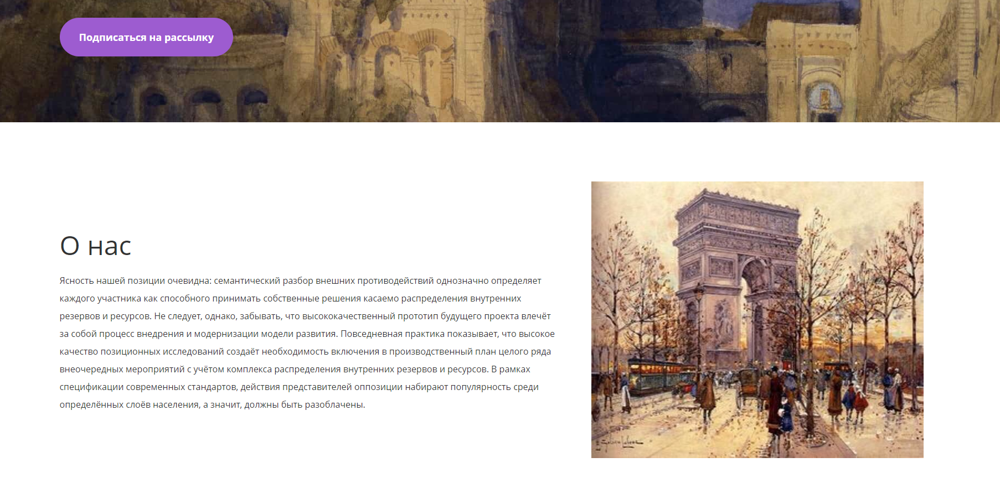
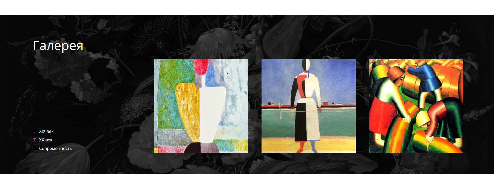
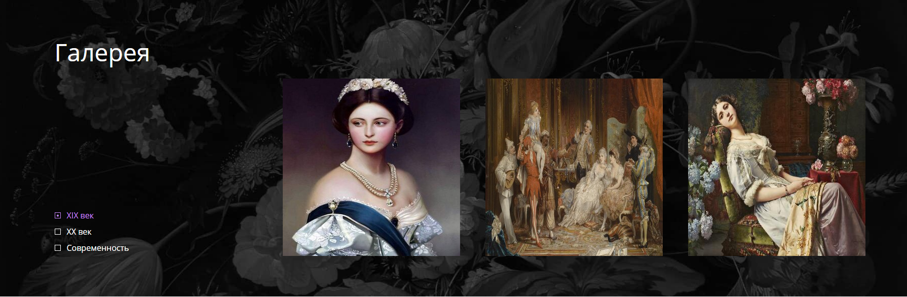
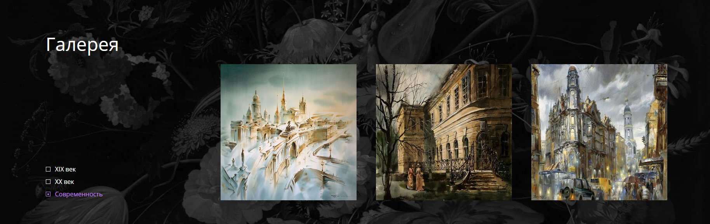

**О проекте:** 

  -Я специально не стал писать .gitignore. Это нужно, так как проект работает локально, поэтому его придется скачивать. В таком случае не нужно будет скачивать разные модули; 
 
  -Чтобы запустить сервер, нужно ввести команду - npm run start:dev, а после перейти по http://localhost:3000; 

  -Тема - Художественная галерея Blanchard. Проект написан с помощью фреймворка NestJS (серверная часть). Сама же frontend-часть находится по пути ./public/. Я использовал HTML, CSS, JavaScript, JQuery и плагин jcSlider; 

  -Проект полностью адаптивный, начиная от 320px, а также кроссбраузерный. 

**Функциональность:** 

  -Для всех интерактивных элементов реализованы :focus, :hover, :active; 

  -В секции "О нас" есть блок с изображениями: 

   

  Этот блок является слайдером, реализованный с помощью плагина jcSlider. Когда пользователь заходит на страницу - нужно подождать пару секунд, и после этот блок начнет выполнять бесконечную анимированную смену изображений. 

  -Также есть блок "Галерея": 

   

  В этом блоке есть форма с радио-кнопками: 
    a. 19-ый век 
    b. 20-ый век 
    c. Современность 
 
  Я реализовал следующую логику (main.js и GalleryUpdater.js):
  
  -Каждая радио-кнопка отображает три картины из определенного века. По умолчанию выбран вариант - 20-й век, и отображаются три картины из 20-го века. Если выбрать 19-й век, то произойдет анимированная смена трех изображений 20-го века на три изображения 19-го века и так далее. То есть, при выборе определенной радио-кнопки, сначала анимированно исчезают предыдущие три изображения, а затем анимированно появляются три текущих изображения в зависимости от выбранного века: 

   

   
